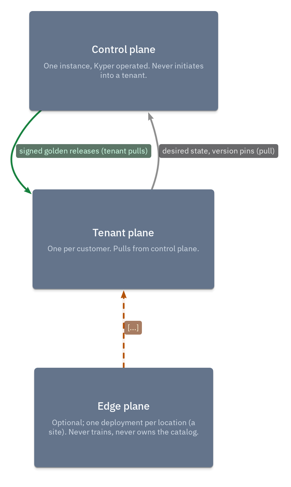
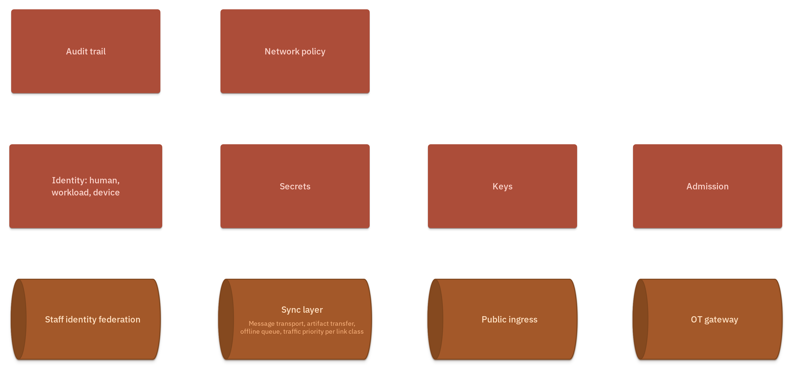

# 3. Context and Scope

The platform's business context is defined by who touches it and through
which named boundary. Every trust boundary is a component in the model
(placement rule 3); nothing crosses into the platform except through one of
them.

## Business context

| Partner | Direction | Named boundary | KYP-ID |
|---|---|---|---|
| Customer OT systems (PLCs, historians, SCADA) | data flows in; connection is push or pull per tenant | OT gateway | KYP-T-DATA-10 |
| Customer users / customer-facing apps | in/out | Public ingress | KYP-T-APP-04 |
| Kyper staff | in (control plane only) | Staff identity federation | KYP-C-TRUST-01 |
| Edge sites (per-site deployments) | both, async | Sync layer | KYP-T-SYNC-01 |

Rendered context diagram (planes and their boundaries):

Trust boundaries view:

## Scope

**In scope:** control plane (fleet, golden artifacts, release control), tenant
plane (dev and ML workspaces, serving, application, orchestration, data layer,
registries, trust and operation bands), edge plane (runtime, site services,
optional application and orchestration).

**Out of scope:** customer OT equipment itself; customer identity providers
(federated, not owned); the products bound per tenant class — products are
bindings ([storage bindings](../../architecture/bindings/storage.yaml),
[ADR-0007](../../adr/0007-object-store-contract-bindings.md)), never
components.

## Technical context

The three planes and their instancing rules are stated in the
[design brief — planes table](../design-brief.md#planes). Interaction
constraints: control plane never initiates into a tenant
([ADR-0001](../../adr/0001-three-planes-pull-only.md)); edge exchanges with
tenant only through the sync layer, with neither side holding a service
address of the other ([ADR-0003](../../adr/0003-generic-sync-layer.md)).

Ingestion direction is a per-tenant fact, not an architectural invariant:
connectors may pull from customer systems (holding credentials to do so) or
receive pushed data, depending on the tenant. The invariant is credential
scope — anything that reaches into a customer environment lives inside that
customer's own tenant plane, never in the control plane. The per-tenant
ingestion mode belongs in the control-plane tenant registry alongside
siteClass values and enabled modules.
