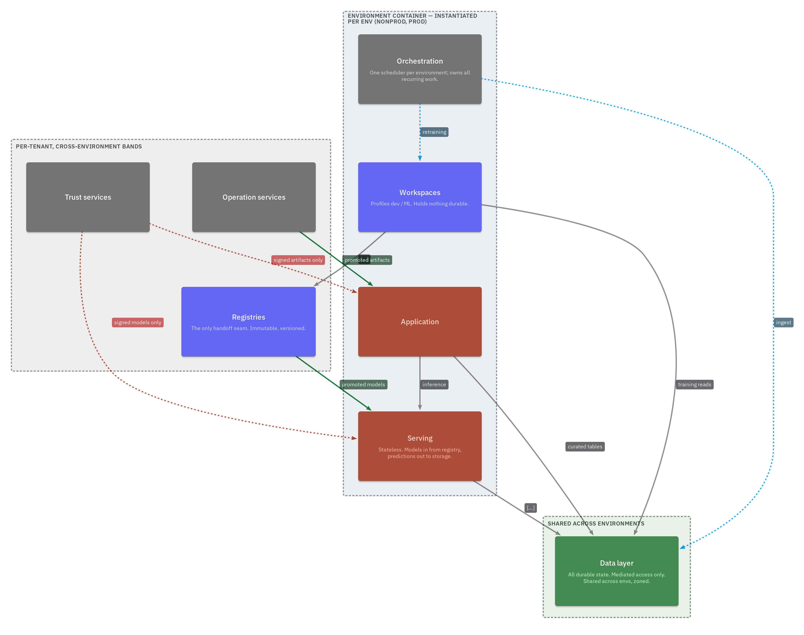
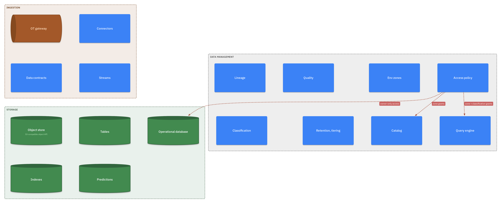
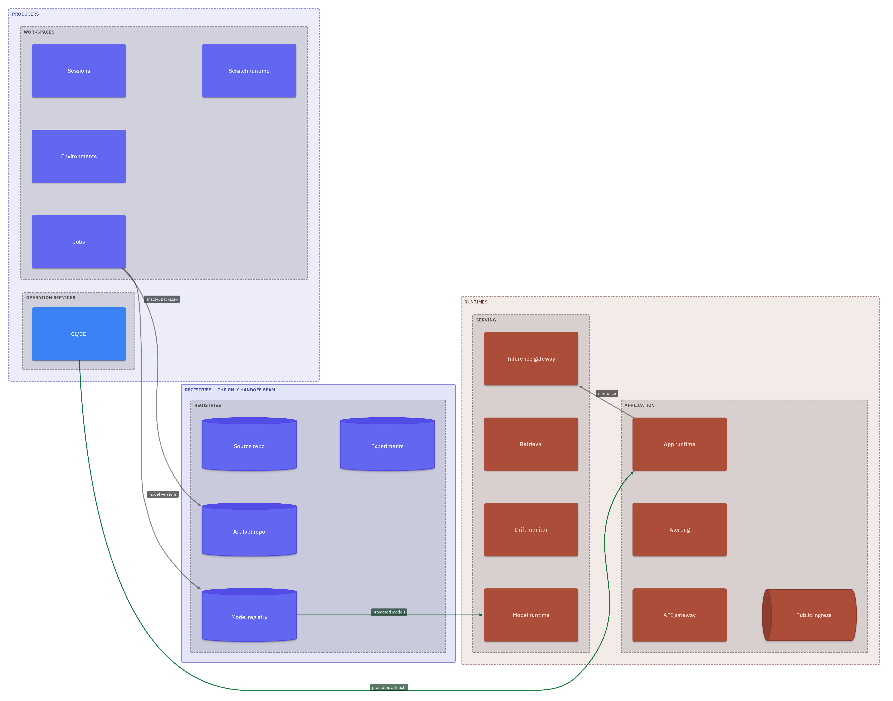
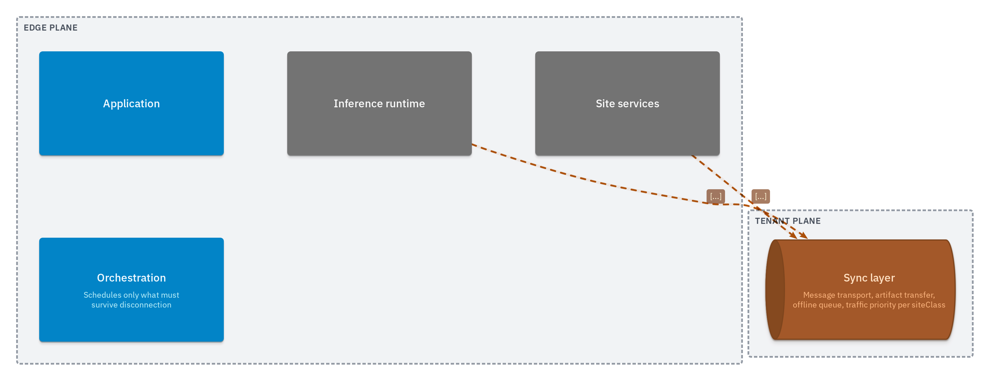
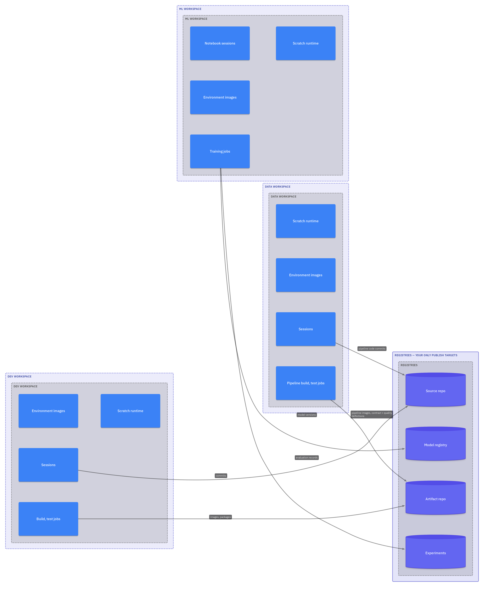
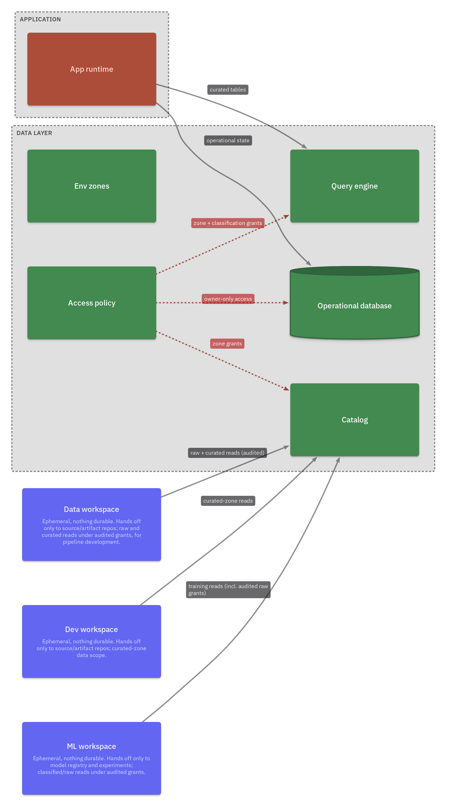
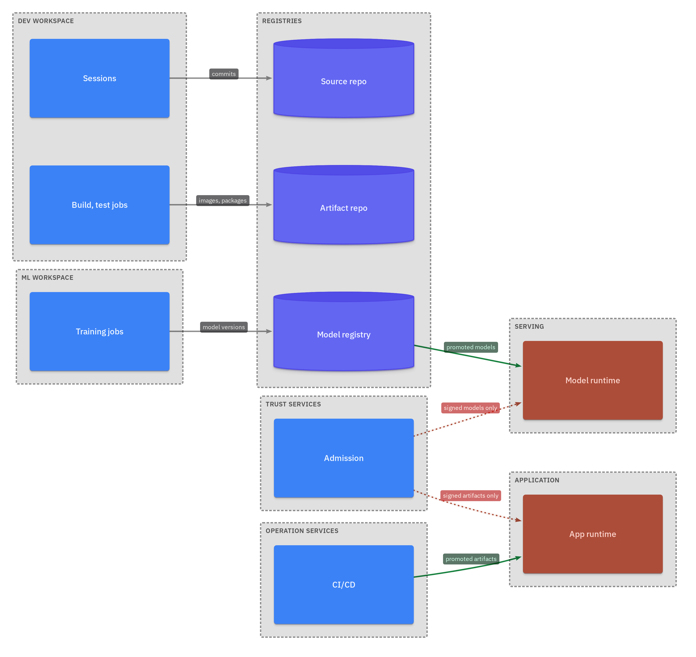

# 5. Building Block View

All diagrams in this section are rendered from the LikeC4 model
(`architecture/model/`) by CI. Never hand-draw a diagram the model can
render. Element identity is the KYP-ID
([taxonomy](../../architecture/taxonomy.md)); kinds and relation kinds are
declared in `architecture/model/spec.likec4`.

## Level 1 — Whitebox: the platform

Three planes with pull-only trust downward
([ADR-0001](../../adr/0001-three-planes-pull-only.md)).

| Block | KYP-ID | Responsibility (one line) |
|---|---|---|
| Control plane | KYP-C | Fleet config, golden artifacts, release control; one instance; never initiates into a tenant |
| Tenant plane | KYP-T | Full platform per customer ([ADR-0002](../../adr/0002-tenant-per-customer.md)); pulls from control |
| Edge plane | KYP-E | Optional per-site inference; exchanges with tenant only via the sync layer |

## Level 2 — Whitebox: tenant plane

Areas grouped by lifecycle: the environment container — dev workspace, ML
workspace ([ADR-0012](../../adr/0012-split-dev-ml-workspaces.md)), serving,
application, orchestration — is instantiated per environment
([ADR-0005](../../adr/0005-two-environments.md)); the data layer is shared
and zoned ([ADR-0006](../../adr/0006-shared-zoned-data-layer.md));
registries, trust and operation bands are per-tenant and cross-environment.

## Level 3 — Selected whiteboxes

### Data layer (KYP-T-DATA)

Ingestion, storage, data management. Store flavours are `metadata.class`,
never kinds. Object store carries a contract; products are per-tenant-class
[bindings](../../architecture/bindings/storage.yaml)
([ADR-0007](../../adr/0007-object-store-contract-bindings.md)).

### The handoff seam (KYP-T-REG)

Registries are the only path from producers to runtimes
([ADR-0004](../../adr/0004-registries-only-handoff.md)).

### Edge plane (KYP-E)

Never trains, never owns the catalog; store-and-forward is the one
intentional co-location of state and behaviour outside the data layer.

## Audience views — the developer's chair

The same model, drawn per developer question (these views regenerate with
the model; instance specifics — endpoints, products, quotas — come from
generated instance sheets, [ADR-0013](../../adr/0013-tenant-registry-record-schema.md)):

Where you work and what you may publish:

How you reach data — everything through the catalog, dev reads curated,
ML raw under audited grants:

From commit to production — registries are the only path in:

## Pending proposals affecting this section

- [ADR-0014](../../adr/0014-data-layer-storage-layers.md) — layered storage
  (time-series, multimodal lakehouse, derived serving stores).
- [ADR-0015](../../adr/0015-data-engineering-workspace.md) — a third (data
  engineering) workspace and a modeled pipeline promotion path.

Diagrams above show the model as currently decided; they re-render when a
proposal is accepted.

## Element registry

The authoritative element list with KYP-IDs is the model itself — browse it
interactively via the rendered site (`npx likec4 start architecture/model`,
or the CI-published site). This document intentionally holds no duplicate
component register.
